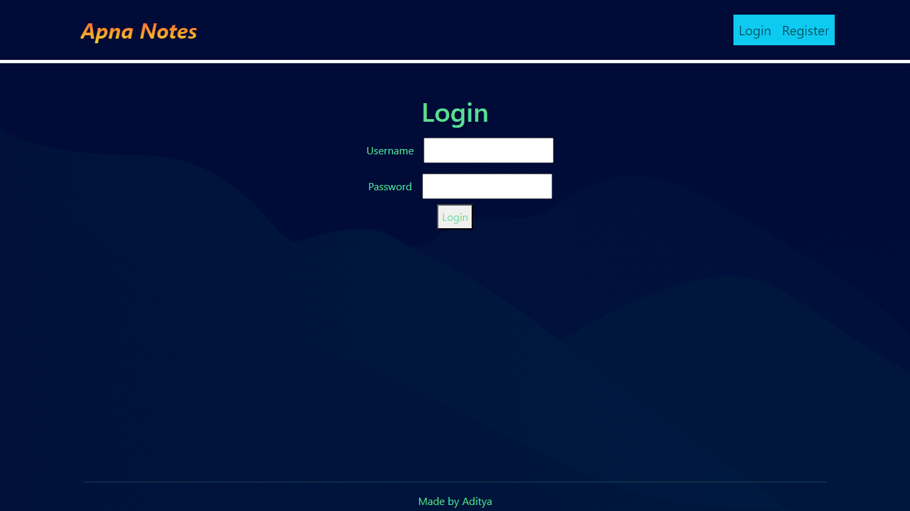
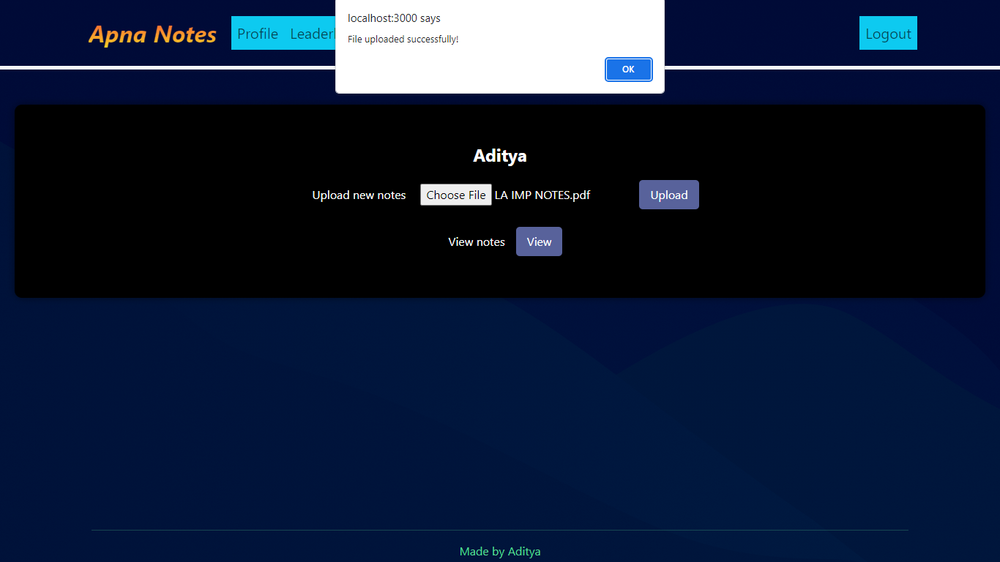
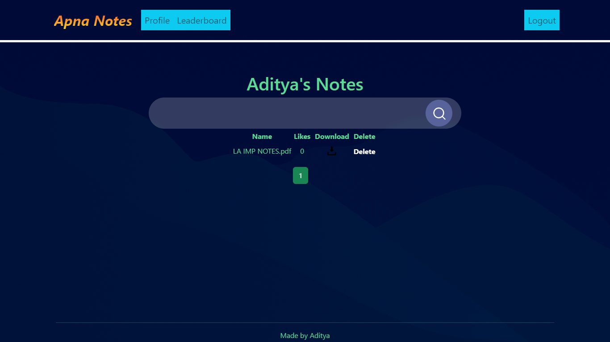
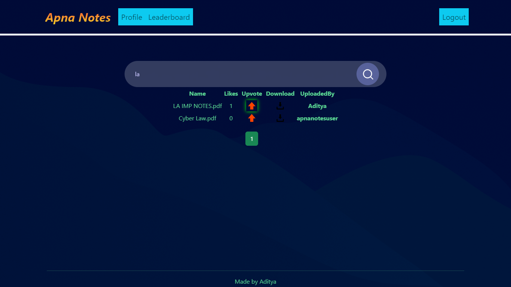
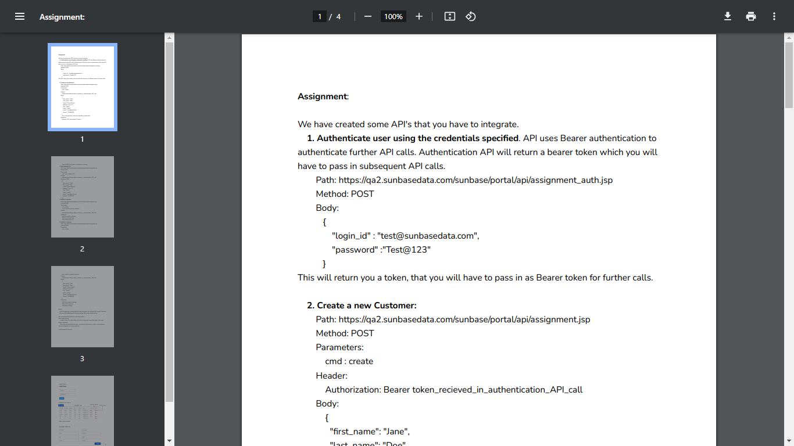

# Apna-Notes
Hub for sharing notes and files

## Features

1. Authentication
2. Validation(like file type, max file size, etc)
3. Leaderboard(uses upvotes for comparison)
4. Search functionality and pagination

## Tech Stack

1. BackEnd: Spring Boot
2. FrontEnd: React.js
3. Database: MySQL Docker container
4. File Database: Firebase

## Screenshots

**1. Home Screen**

**2. Upload File**

**3. List Notes**

**4. Search Notes**

**5.Leaderboard**

**6. View/Download Notes**

