# Apna-Notes V2
Hub for sharing notes and files

## Features

1. Authentication
2. Validation(like file type, max file size, etc)
3. Leaderboard(uses upvotes for comparison)
4. Search functionality and pagination

## Tech Stack

1. BackEnd: Spring Boot
2. FrontEnd: React.js
3. Database: MySQL Docker container
4. File Database: Firebase

## Screenshots V1

**1. Home Screen**

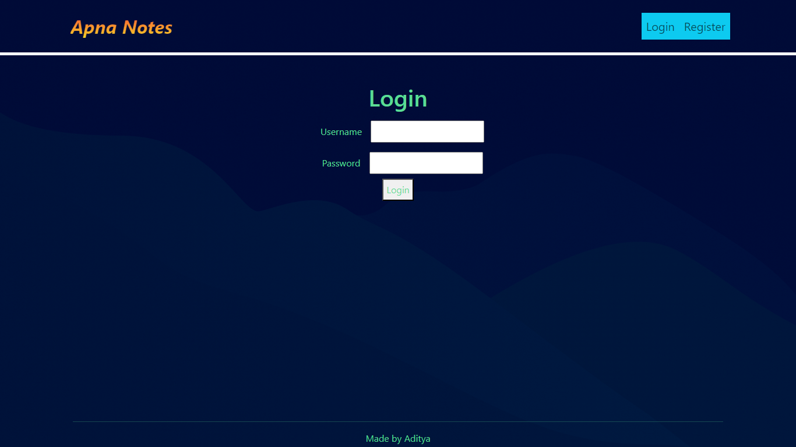

**2. Upload File**

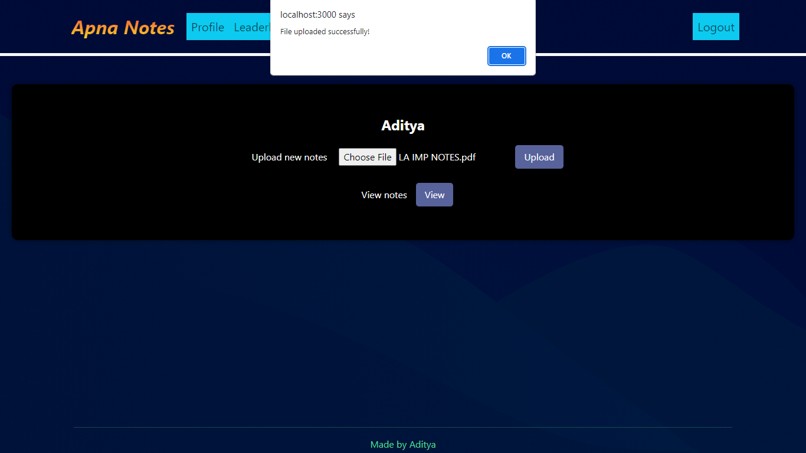

**3. List Notes**

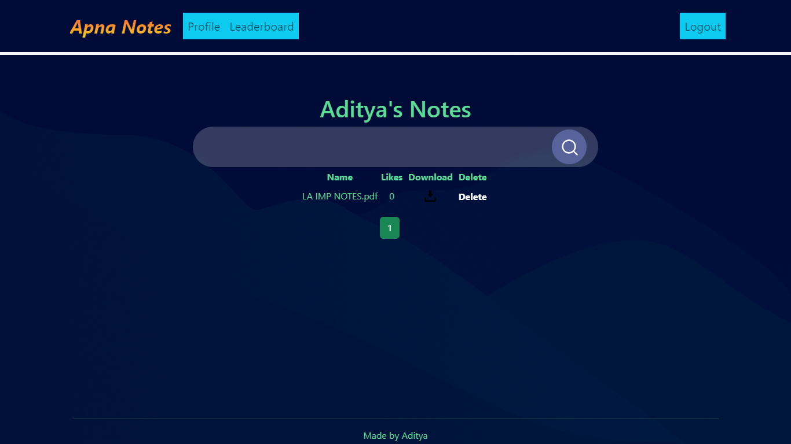

**4. Search Notes**

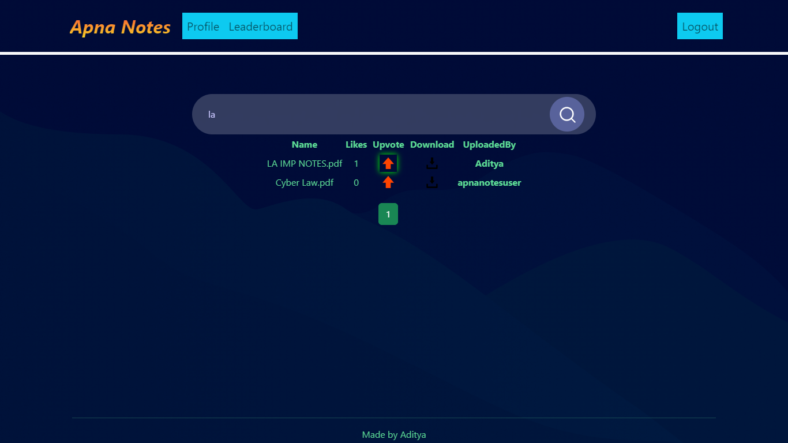

**5.Leaderboard**

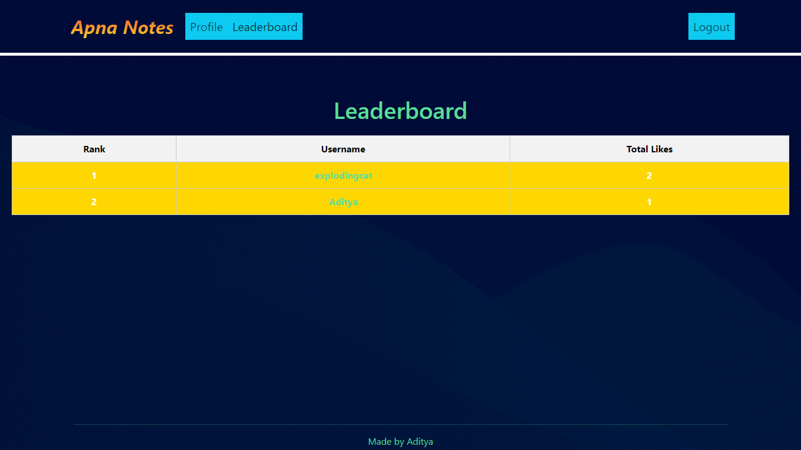

**6. View/Download Notes**

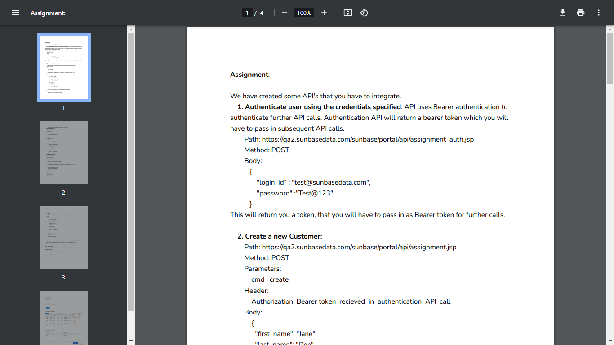

## V2 Changes

**1. Email Based Registration**

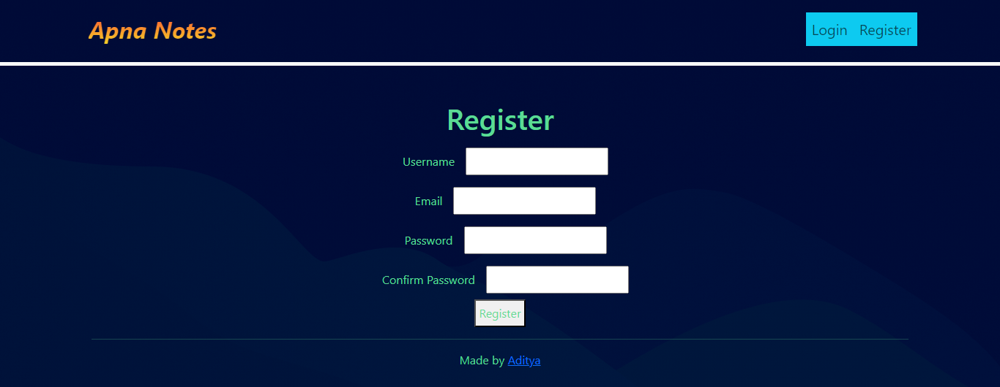

**2. Reset Password**

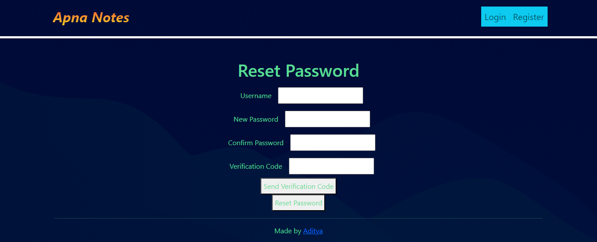

**3. Topic Selection**

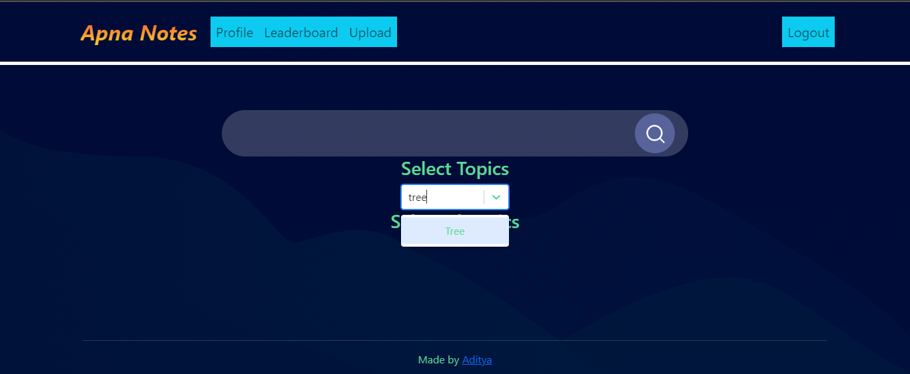

**4. Additional User Information**

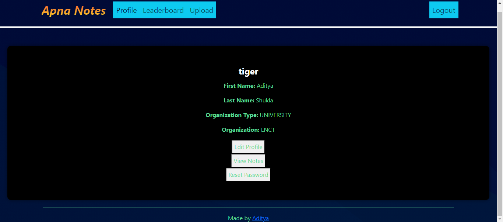

**5. Additional Post Information**

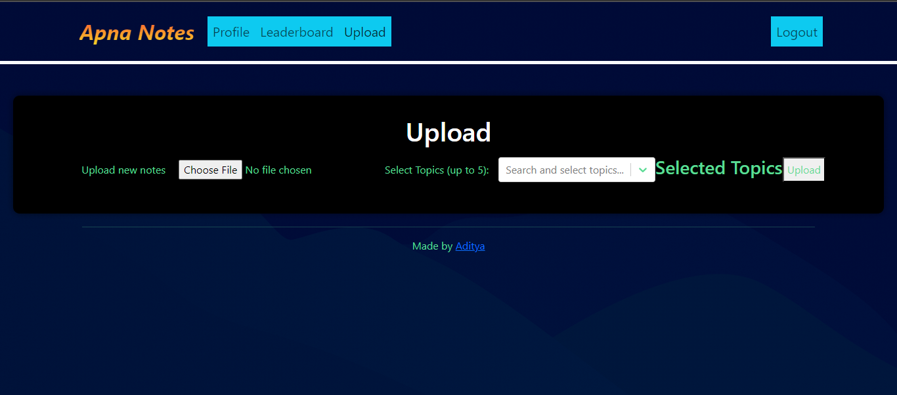
